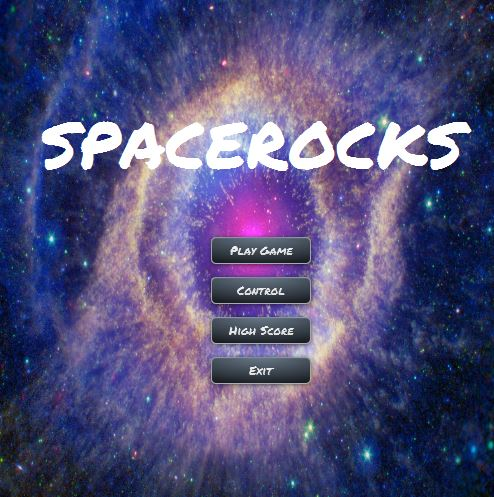

# SpaceRocks

# What is SpaceRocks

SpaceRocks is an implementation of the classic "Asteroids" arcade game in Java. It was created by the four contributors to this repository in order to gain a deeper understanding of Java, JavaFX, and standard OOP principles.

# How Do I Use SpaceRocks?

* SpaceRocks is started by running the Main class of the project, contained in com.spacerocks.main. 
* There are several options within the menu, which will be described in more detail below. 
* To start the game, press the "Play Game" button - the controls are located in the "Control" section of the menu. 

# Main Menu

The Main Menu of SpaceRocks presents the user with several options, each of which are set out below. 

* **Play Game**: This starts a new round of SpaceRocks. A more detailed explanation of the gameplay will be set out later in this ReadMe.

* **Control**: This option shows the main controls for SpaceRocks gameplay, which are as follows:

| Button  | Action  |
|---|---|
| Up Arrow | Thrust  |
| Left Arrow  | Turn Left |
| Right Arrow | Turn Right |
| Shift | Hyperspace |

* **High Score**: This option shows the top five scores achieved to date for players of SpaceRocks on any given machine. Every time a round of SpaceRocks finishes with a score that is eligible for entry in this section, a scores file is updated within the project directory. The high scores are read from this file. 

* **Exit**: This option quits the application.

# Technologies Used

* **Java**: This project was completed as part of the Java Programming module, and as such the language used for SpaceRocks was Java.

* **JavaFX**: Upon careful consideratoin, JavaFX was considered the best tool for the creation of SpaceRocks. Its powerful AnimationTimer feature allowed for easy updates of objects on the screen every frame, and its syntax allowed for the use of CSS styling, which is something that the team was already familiar with. 

* **Maven**: Maven was chosen as the build tool for this project. Because this project does not have too many dependencies, there were very few configurations that needed to be done, and Maven was essentially used 'out of the box'. 

**END**